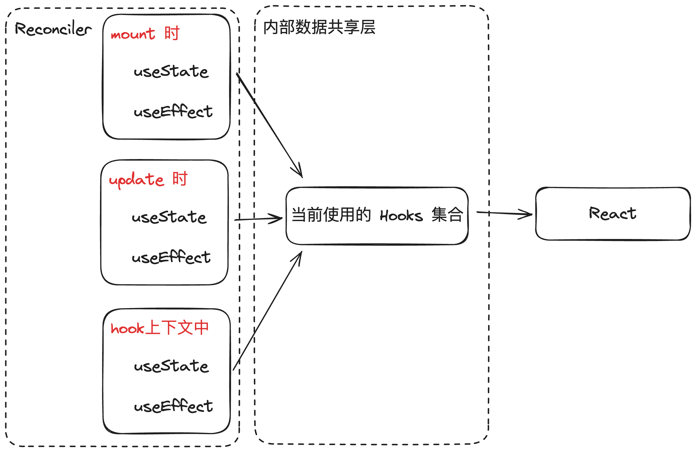
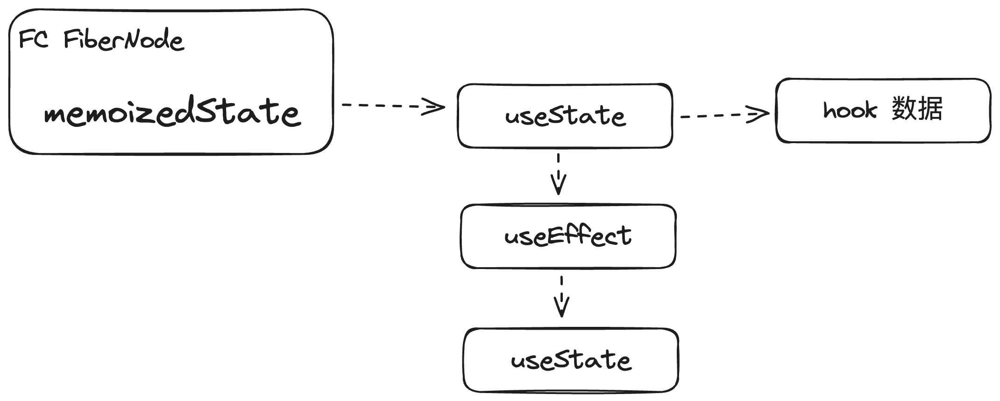

## 1 JSX转换

### 1.1 什么是 JSX

JSX 是 JavaScript 的一种语法扩展，允许开发者在 JavaScript 文件中编写类似 HTML 的代码。

### 1.2 什么是 JSX 转换

包括两部分：

- 编译时：由 babel 实现
- 运行时（dev、prod 双环境）：实现 jsx 方法或 React.createElement 方法

运行时主要任务：

- [x] jsx方法
- [x] 实现打包流程
- [x] 实现调试打包结果的环境

### 1.3 实现 JSX 转换

#### 1.3.1 jsx 方法

由于 babel 实现了编译时的 JSX 转换，所以只需要将 babel 的输出，构造成一个 React 元素就可以。

1. `jsx` 函数

- jsx 接收 `type` 、`config` 和 `maybeChildren` 作为参数
- 遍历 `config` 对象的属性，并将其中的 `key` 和 `ref` 属性分别保存起来
- 根据`maybeChildren`的长度将子元素添加到 `props` 的 `children` 中，如果还有其他的属性就在 `props` 中保存起来

2. `jsxDEV` 函数

- 与 `jsx` 函数不同，`jsxDEV` 不接受 `maybeChildren` 作为参数
- 其他与 `jsx` 基本类似

#### 1.3.2 打包流程

主要是 rollup 的配置项和插件的使用

用到的都是比较基础的配置项，像 `input` 、`output` 、`plugins` 这种

同时使用了部分插件：

- rollup-plugin-typescript2
  - 可将 `.ts` `.tsx` 文件转换为 `.js` 文件
- @rollup/plugin-commonjs
  - rollup 官方提供的插件，可将 CommonJS 模块转换成 ES6 模块
- rollup-plugin-generate-package-json
  - 用于在最终输出的 dist 目录下生成 package.json 文件

#### 1.3.3 实现调试打包结果的环境

通过 `pnpm link xxx --global` 将当前的项目链接到全局环境下，使其他项目能共享当前项目

## 2 Reconciler

### 2.1 Reconciler 的工作方式

对于同一个节点，比较其 `ReactElement` 和 `fiberNode` ，生成子 fiberNode ，并根据比较结果生成不同的标记（插入、删除、移动......），
不同的标记又对应不同宿主环境（浏览器环境） API 的执行


挂载 `<div></div>` ：

1. jsx 经过编译时的 babel 和运行时的 jsx方法转译成 `type` 为 `div` 的 `React Element`
2. 当前的 `React Element` 会跟对应的 `fiberNode` 比较，但是当前对应 `fiberNode` 为 `null`
3. 比较的结果会生成一个子 `fiberNode` ，同时也会生成 `Placement` 标记
4. `Placement` 对应插入操作，所以宿主环境 API 就会插入一个 `div` 元素到 `DOM` 中

将 `<div></div>` 更新为 `<p></p>` ：

1. jsx 经过 babel 和 jsx 方法转译成 `type` 为 `p` 的 `React Element`
2. 当前的 `React Element` 会跟对应的 `fiberNode {type:'div'}` 比较
3. 比较的结果会生成一个子 `fiberNode` ，同时会生成 `Deletion` 和 `Placement` 标记
4. 宿主环境 API 就会先执行删除操作，将 `div` 元素删除，然后再执行插入操作，将 `p` 元素插入到 `DOM` 中

当所有 React Element 比较完之后，会生成一个 fiberNode 树，一共会存在两个 fiberNode 树：

- current ：与视图中真实 UI 对应的 fiberNode 树
- workInProgress ：触发更新之后，在 reconciler 中计算的 fiberNode 树

在 React 更新的过程中，current 树 和 WIP 树通过交替使用来实现更新。
当 React 开始处理更新时，在 WIP 树进行更新和变更的计算，确定该次更新的 WIP树的结构之后，WIP 树会与 current 树进行比较，最终确定需要更新的部分，调用宿主环境 API 将需要更新的部分更新到 DOM 中。

更新完成之后，WIP 树由于拥有最新的虚拟 DOM 结构，WIP 树会成为新的 current 树，而之前的 current 树则会成为下一次更新的 WIP 树。

这种来回更新的技术就是双缓存技术

### 2.2 JSX 消费的顺序

JSX 消费的顺序，就是以 DFS 顺序遍历 JSX。

```jsx
<Card>
	<h1>hello</h1>
	<p>react-demo</p>
</Card>
```

上述 `Card` 组件的消费顺序：


### 2.3 如何触发更新

常见触发更新的方式：

- ReactDOM.createRoot().render() 、 老版本的 ReactDOM.render
- this.setState
- useState 的 dispatch 方法

希望通过一套统一的更新机制，兼容上述所有触发更新的方法，同时方便后续扩展 `优先级机制`

### 2.4 更新机制的组成

- 代表更新的数据结构 -- Update
- 消费 update 的数据结构 -- UpdateQueue


实现的关键点：

- 更新可以发生于任何组件，但是更新的流程是从根节点递归的
- 需要一个统一的根节点保存通用信息

### 2.5 mount 流程

mount 流程的目的：

- 生成 WIP FiberNode 树
- 为树当中的 FiberNode 标记副作用 flags

mount 流程的步骤：

- 递： beginWork
- 归： completeWork

#### 2.5.1 beginWork 流程

对如下结构的 reactElement

```HTML
<A>
  <B />
</A>
```

当进入 A 的 beginWork 时，通过对比 B current fiberNode 与 B reactElement，生成 B 对应的 WIP FiberNode

在此过程中，最多会标记 2 类与 `结构变化` 相关的 flags：

- Placement

  插入：a -> ab

  移动：abc -> cba

- ChildDeletion

  子节点删除：ul > li _ 3 -> ul > li _ 2

不包含 `属性变化` 相关的 flags：

- Update

  `<div class='a'></div>` -> `<div class='b'></div>`

HostRoot 的 beginWork 的工作流程：

1. 计算状态的最新值
2. 构造子 fiberNode

HostComponent 的 beginWork 的工作流程：

1. 构造子 fiberNode

由于 HostText 没有子节点，所以 HostText 没有 beginWork 的工作流程

#### 2.5.2 beginWork 性能优化策略

考虑如下结构的 reactElement

```HTML
<div>
  <p>hello</p>
  <span>world</span>
</div>
```

理论上，上述 reactElement 在 mount 流程结束之后，应该包含如下 flags：

- world - Placement
- span 标签 - Placement
- hello - Placement
- p 标签 - Placement
- div 标签 - Placement

### completeWork

流程：

1. 创建或标记元素更新
2. flags 冒泡

#### flags 冒泡

complete 属于递归中的归阶段，从叶子元素开始，自下而上。通过 fiberNode.subtreeFlags 来记录该 fiberNode 的所有子孙 fiberNode 上被标记的 flags，在 Render 阶段中就可以通过 subtreeFlags 快速确定该 fiberNode 所在子树是否存在副作用需要执行

### commit 阶段

3 个子阶段

#### beforeMutation 阶段

#### mutation 阶段

在 mutation 阶段，根据 fiberNode.subtreeFlags 是否包含 MutationMask 中的 Flags 以及 fiberNode 是否存在子节点来决定是否向下遍历。
如果 subtreeFlags 中有 MutationMask 包含的 Flags，则执行对应操作。

- Placement：

要插入节点，需要先根据当前 fiberNode 的父级 DOM 元素，递归地将子节点插入到对应的 DOM 中。

#### layout 阶段

## Function Component

## Hook

### 数据共享层

为了能让 hook 拥有感知上下文的能力，React 在不同的上下文中调用的 hook 不是同一个函数。

如下图所示，在不同生命周期或 hook 上下文中都有一个属于它本身的 hooks 集合，这些集合共同存放于 React 内部的数据共享层，然后再由 React 统一向外抛出。

同时，为了让 hook 能感知上下文，需要在 reconciler 中实现 hook，然后在 React 中导出，即从 reconciler package 跨越到 react package 中。

所以需要通过一个内部的数据共享层以 hook 集合的形式来管理 hook，当不同的阶段调用 hook，对应阶段的 hook 集合就会指向内部数据共享层，React 调用的并不是 hook 的实现，而是当前阶段的 hook 集合



**注意：**

**增加内部数据共享层，意味着 reconciler 和 React 产生关联**

如果两个包产生关联，需要考虑，两者的代码是打包在一起还是分开？

如果打包在一起，在打包之后的 ReactDOM 中会包含 React 的代码，那么 ReactDOM 中也会包含一个内部数据共享层，React 中也会包含一个内部数据共享层，两者并不是同一个数据共享层。

所以希望两者分开打包。

### Hook 数据结构

fiberNode 中可用的字段

- memoizedState
- updateQueue



对于 FC 对应的 fiberNode，有两层数据

- fiberNode.memoizedState 对应 hooks 链表
- 链表中每个 hook 对应自身的数据

### 实现 useState

包括两个任务

- 实现 mount 时的 useState
- 实现 dispatch 方法，并且接入现有流程中

